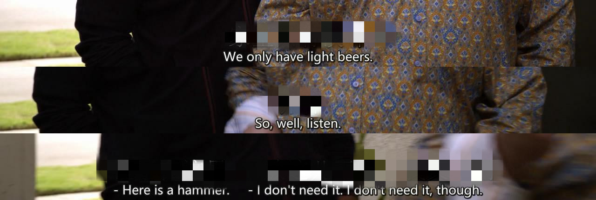

# golean

#### what is this ?

A program that combines video screenshots with only subtitles. And you can set screen caption height

#### Instructions

Download the files in the bin directory, edit the configuration files in advance, set the options in `config.toml`, and then execute `./process_image` (Linux) or `./process_image.exe` (Windows)

#### To Do

- [x] Description of the implementation of jpeg format
- [ ] Added support for png/bmp format
- [ ] Provides a more convenient Web UI based on a self-made framework
- [ ] Provide command line options

---

